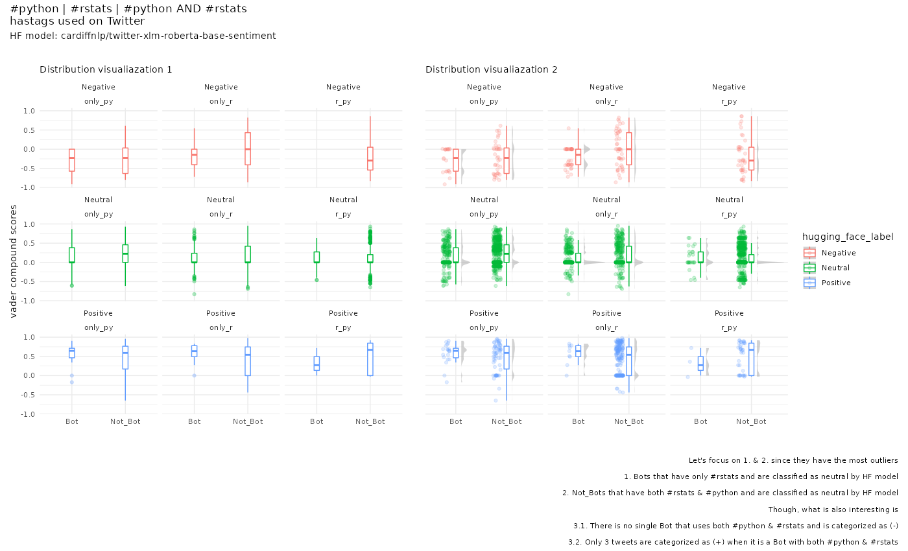

# Sentiment Analysis Comparison
## of tweets that contain #python #rstats & both #python #rstats

Comparison of sentiment analysis conducted with a lexicon and rule-based dictionary and state-of-the-art pre-trained language models. 

More specifically, [vader](https://github.com/cjhutto/vaderSentiment) compound sentiment scores and the classification obtained from Hugging Face's [cardiffnlp/twitter-xlm-roberta-base-sentiment](https://huggingface.co/cardiffnlp/twitter-xlm-roberta-base-sentiment) transformer model are compared.

The comparison reveals many outliers in the two following categories:
1. Bots that have only #rstats and are classified as neutral by HF transformer model
2. Non-Bots that have both #rstats & #python and are classified as neutral by HF transformer model

The tweets with min. and max. vader compound scores are further analyzed with an interpretable AI framework.

The overall analyses and results highlight the importance of tokenization and how different tokenization algorithms can dramatically impact NLP tasks.